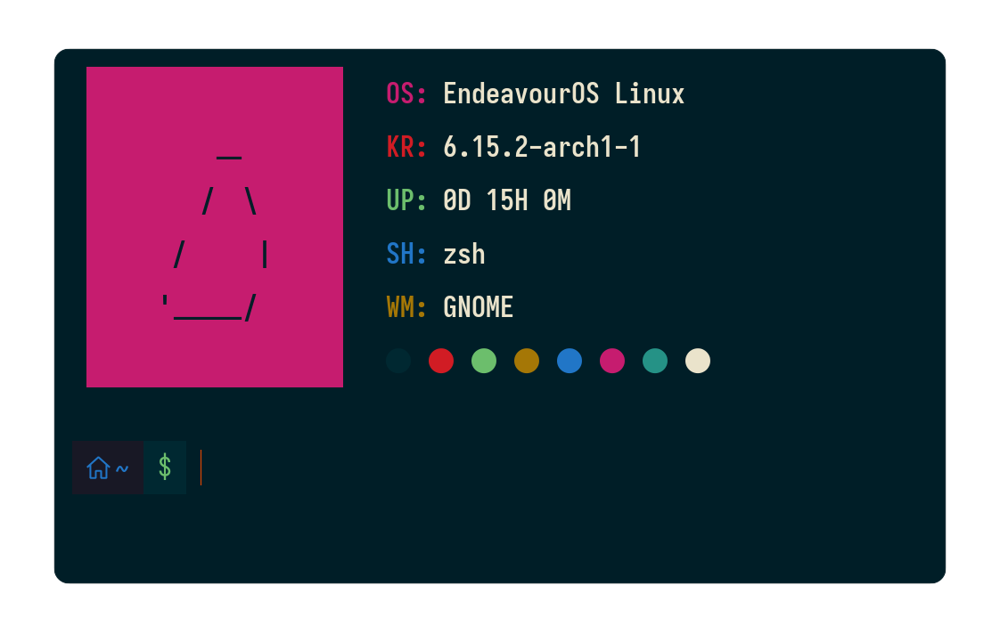
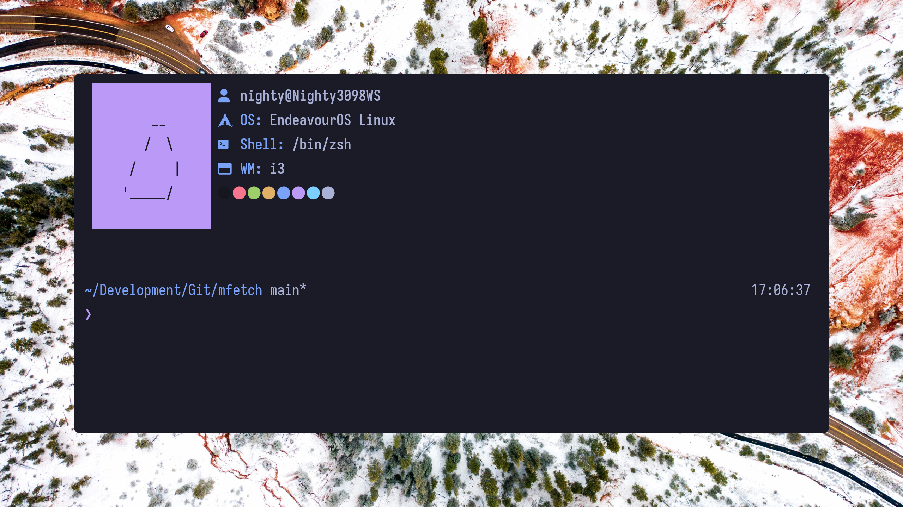
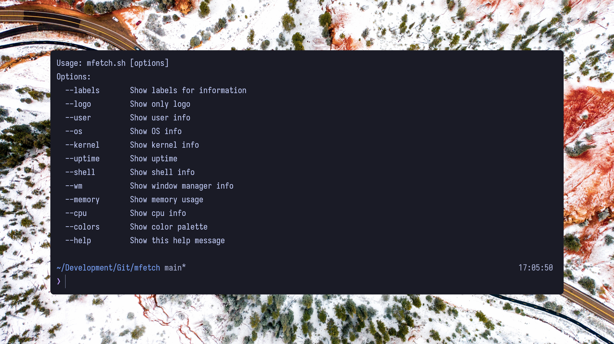

<h1 align="center"> :herb: System Fetch Tool :herb: </h1>

</br>


<p align="center">
<a href="./LICENSE.md"></a>


  </br>
</p>

</br>
</br>
<h1 align="left">📋 About</h1> 



</br>
</br>
</br>

- [`🌟 Features`](#-features)
- [`📥 Installation`](#-installation)
- [`🚀 Usage`](#-usage)
- [`🎨 Customization`](#-customization)
- [`🐧 Supported Systems`](#-supported-systems)
- [`🤝 Contributing`](#-contributing)

</br>
</br>
</br>
</br>

## 🖼️ Gallery




</br>
</br>

## 🌟 Features

- **Elegant ASCII Art** - Displays your distro's logo in beautiful colors
- **Comprehensive System Info** - Shows CPU, memory, OS, kernel, uptime and more
- **Nerd Font Icons** - Uses beautiful icons for visual appeal
- **Fully Customizable** - Show only the info you want
- **Responsive Design** - Automatically centers output in your terminal
- **Colorful Output** - 8-color scheme with both foreground and background options
- **Cross-Platform** - Works on Linux and macOS

## 📥 Installation

1. **Prerequisites**:
   - Bash 4.0+
   - Nerd Fonts installed (for icons)
   - Basic GNU tools (lsb_release, free, uptime, etc.)

2. **Installation Options**:

**Git Clone**:
```bash
git clone https://github.com/Nighty3098/mfetch
cd mfetch
bash install.sh
```

## 🚀 Usage

Basic usage:
```bash
mfetch
```

Show specific sections:
```bash
mfetch --cpu --memory --os
```

Show only logo:
```bash
mfetch --logo
```

Show help:
```bash
mfetch --help
```

### Available Options:
| Option       | Description                          |
|--------------|--------------------------------------|
| `--user`     | Show user@hostname                   |
| `--os`       | Show OS information                  |
| `--kernel`   | Show kernel version                  |
| `--uptime`   | Show system uptime                   |
| `--shell`    | Show current shell                   |
| `--wm`       | Show window manager                  |
| `--memory`   | Show memory usage                    |
| `--cpu`      | Show CPU information                 |
| `--colors`   | Show color palette                   |
| `--logo`     | Show only ASCII logo                 |
| `--help`     | Show help message                    |

## 🎨 Customization

### Color Schemes
The application uses the current terminal theme. You can change this in the application code:

```bash
# Foreground Colors
BLACK="\e[1;30m"
RED="\e[1;31m"
GREEN="\e[1;32m"
YELLOW="\e[1;33m"
BLUE="\e[1;34m"
MAGENTA="\e[1;35m"
CYAN="\e[1;36m"
WHITE="\e[1;37m"

# Background Colors
BLACK_BG="\e[7;30m"
RED_BG="\e[7;31m"
...
```

### Adding New Distro Logos
To add support for a new Linux distribution, add a new case to the `raw_ascii_art()` function:

```bash
"Your Distro Name from 'lsb_release -d | cut -f2'")
    echo -e "${COLOR_BG}                ${RESET_BG}"
    echo -e "${COLOR_BG}    ASCII ART   ${RESET_BG}"
    ...
    ;;
```

## 🐧 Supported Systems

The script automatically detects and displays appropriate ASCII art for:

- Arch Linux
- Debian
- Ubuntu
- openSUSE
- Alpine Linux
- Manjaro
- EndeavourOS
- Bedrock Linux
- macOS (multiple versions)
- Plus a generic fallback logo

## 🤝 Contributing

Contributions are welcome! Here's how to help:

1. **Report Bugs**: Open an issue describing the problem
2. **Suggest Features**: Propose new functionality
3. **Add Distro Support**: Submit ASCII art for new distributions
4. **Improve Code**: Submit pull requests for optimizations

### Development Guidelines:
- Maintain consistent coding style
- Keep ASCII art to 6 lines × 16 characters
- Test changes on multiple systems
- Document new features

## 📜 License

MIT License - see [LICENSE](LICENSE) for details.

---

**Enjoy your system insights in style!** ✨
